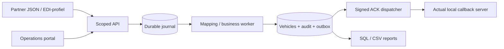

# Terminal Flow Control — Job Execution Repository

## Why this repository exists

Dit is hoe een competente, betrouwbare medewerker de **ICO IT Development Officer**-rol praktisch zou uitvoeren: een werkende applicatie-/integratieketen, professioneel requirementswerk en concrete operationele dossiers. Geen random codingproject en geen claim dat ik voor ICO gewerkt heb.

**Assumption / realistic simulation:** fictieve RoRo-terminal, partners, procedures, historische incidenten en beslissingen. Alleen de publieke [vacature](https://www.icoterminals.com/nl/jobs/it-development-officer) bepaalt de doelrol. Werkelijke technische testresultaten zijn apart vastgelegd. Geen vertrouwelijke gegevens of echte productcredentials.

## Job being simulated

Technische projectplannen/specs/CRQ’s, leveranciers en capaciteit/budget; core-applicaties en nieuw TOS; application modelling/releases; EDI en rapportering; portalen/koppelingstools; tweede lijn incident/problem/change; gebruikersopleiding, onboarding en wekelijkse IT/businessrapportage voor Kallo en Zeebrugge. [Volledige analyse](docs/role/vacancy-analysis.md), [skills](docs/role/skills-matrix.md), [bewijs per vereiste](docs/role/evidence-matrix.md).

## Business context

Partners melden aankomst, verplaatsing en vertrek van synthetische voertuigen. Operations corrigeert gecontroleerd locaties en laat holds door de bevoegde businessrol vrijgeven. IT bewaakt ontvangst → verwerking → databasecommit → ACK → rapport. Transportreceipt is geen businesssuccess. Eén business-effect ondanks herhaalde verzending, veilige herstelkeuzes en begrijpelijke stakeholderupdates zijn de centrale doelen.

## Architecture



Java 21 modular monolith; prepared JDBC/transaction constraints; H2 Oracle-compatibility mode; real Servlet WAR plus a fast JDK HTTP adapter. Actual local WAR deployment on WildFly EE10 is separately tested. [Five architecture diagrams](docs/architecture/system-context.md), [decisions](docs/architecture/decisions.md), [component catalogue](docs/architecture/component-catalogue.md).

## Responsibilities demonstrated

| Responsibility | Concrete output |
|---|---|
| Requirements / technical planning | BR/FR/NFR, acceptance, six work packages, three CRQ’s |
| Application modelling / core management | Catalogue, current state, journal/audit/diagnostics |
| Integration / EDI / reporting | Working API, mapping, idempotency, outbox/HMAC-ACK, SQL/CSV |
| Second-line ownership | Ten incidents, three problems, eleven runbooks, twenty tickets |
| Release / deployment / recovery | Real WAR, hashmanifest, actual server lifecycle, snapshot/freshrestore/cutovergate |
| Stakeholders / vendors / budget | RACI, vendor work package, forecasts, NL/EN/FR updates |
| Training / quality / safety | Teach-back/buddy plan, server role/version/reason/audit and hold rules |
| Automation / prevention | Eight focused operational automations and real tests |

## Repository map

`docs/` contains role/architecture/requirements/systems/integrations/runbooks/incidents/problems/changes/releases/security/monitoring/testing/stakeholders/onboarding. `src/main/` contains actual Java/runtime/portal code; `src/scripts/` the operations CLI and ACK simulator. `database/`, `api/`, `edi/`, `monitoring/`, `deployment/` and `operations/` hold purpose-specific artifacts. `tests/` and `src/test/java/` contain actual acceptance/domain/recovery checks. [Structure and rationale](docs/architecture/repository-structure.md).

## Core scenarios

1. Valid partner arrival for both sites, receipt → commit → signed ACK.
2. Same key/new transport-ID/concurrent duplicate → one effect; changed payload →409.
3. Mapping rejects a code → CRQ/mappingchange → authorized redrive → audit.
4. ACK timeout after commit → retry only confirmation, never repeat vehicle mutation.
5. Portal correction → role/scope/version/reason; hold blocks departure and requires authorized release.
6. Partial readiness/deployment failure → identify actual schema/config/lifecycle; safe recovery/gates.
7. Wrong reporting grain → explain delivery/event counts versus current vehicles.
8. New-system snapshot difference → NO_GO with key/field evidence.

## Technologies

| Vacancy | Here / important boundary |
|---|---|
| JBoss | Genuine Jakarta Servlet WAR tested on WildFly EE10; ICO variant unknown |
| Oracle | H2/JDBC transactional lab; **not real Oracle Database** |
| AIX / IBM P-series | macOS/Linux execution + explicit platform handover; **no hardware/AIX administration claim** |
| iWay | Implemented mapping/queue/outbox concepts; **no licensed iWay runtime** |
| WebFOCUS | Real SQL/CSV and report contracts; **no WebFOCUS runtime** |
| Apex | Working equivalent task portal and concrete portingplan; presumed Oracle APEX remains to confirm |
| N/E/F, Office, project method | Multilingual samples, CSV budget/portfolio and professional plans/CRQ’s; not qualification certificates |

Full [product substitution matrix](docs/systems/platform-substitutions.md). No Kubernetes, unnecessary microservices or AI.

## Incident management

[Operating manual](docs/role/role-operating-manual.md) explains morning/day/endshift/week/month/critical-event ownership. [Incidents](operations/incidents/index.json) are complete fictional records with hypothesis/counterevidence, log/query, recovery and communication. [Problems](docs/problems/PRB-001-repeated-ack-timeouts.md) trace recurrence to structural changes. [Runbooks](docs/runbooks/integration-failure.md) begin read-only and distinguish safety/business/technical mandaat.

## Integration management

[OpenAPI 3.1](api/specifications/openapi.json), [partner contract](docs/integrations/partner-contract.md), [EDI samples](edi/samples/arrival.json), [received-not-processed guide](edi/troubleshooting/received-not-processed.md). Required fields, strict shape/types/date, role/site/partner checks, bounded retries, changed-payload conflict, stable ACK identity and separate commit/delivery states. JSON is the labelled local EDI profile; no EDIFACT standard is attributed to ICO.

## Deployment

Requirements: JDK 21, Maven 3, Python 3.10+. Node 22 only for optional browser acceptance. Commands run from repository root. No Docker required.

```sh
mvn -B -ntp package
python3 src/scripts/manage.py init
python3 src/scripts/manage.py start
python3 src/scripts/manage.py smoke
```

Open `http://127.0.0.1:8090/`. Tokens are generated in `runtime/.env` with 0600 permissions; retrieve only locally, never publish. CLI supplies appropriate tokens without printing them. Portal needs a reader/operator/partner token pasted by the local owner; it remains only in browser memory.

```sh
python3 src/scripts/manage.py request ADMIN GET /api/admin/diagnostics/outbox-status
python3 src/scripts/manage.py stop
```

Real application-server path (official download, ~267MB; SHA256 pinned):

```sh
# Start local lab first so the ACK simulator is available.
python3 deployment/scripts/wildfly_lab.py install
python3 deployment/scripts/wildfly_lab.py start
python3 deployment/scripts/wildfly_lab.py test
python3 deployment/scripts/wildfly_lab.py redeploy
python3 deployment/scripts/wildfly_lab.py stop
```

WAR URL `http://127.0.0.1:8280/terminal-flow/`; separate file DB from fast local adapter. [Deployment runbook](deployment/deployment-runbook.md), [release 1.4.0](docs/releases/REL-1.4.0.md), [rollback/data recovery](deployment/rollback-plan.md). Release approvals are explicitly lab rehearsals, not actual company approvals.

## Monitoring

```sh
python3 src/scripts/manage.py health
python3 src/scripts/manage.py failed
python3 src/scripts/manage.py reconcile
python3 src/scripts/manage.py alerts
python3 src/scripts/manage.py log-summary
python3 src/scripts/manage.py release-manifest
```

Exit0=success; health/request failure1; alerts2=open triage/critical inventory; reconciliation2=differences. Acceptance labs deliberately create rejected messages, so an open-rejection alert after testing can be expected. Dashboard values are actual measurements; no fabricated uptime/p95/DB-poolcounts. [Strategy and limits](docs/monitoring/observability.md), [automation register](docs/role/automation-register.md).

## Documentation

Reviewed requirements and decisions explain why/when/how/failure/recovery. Historical narrative separate from actual verification. `src/scripts/author_artefacts.py` maintains fixtures/schema/query mirrors and operational samples; **does not generate fake execution evidence**. Run after editing canonical artifacts, then repository audit. [Security](docs/security/security-baseline.md), [testing](docs/testing/test-strategy.md), [stakeholders](docs/stakeholders/communications.md), [90 days](docs/onboarding/30-60-90-day-plan.md).

## What this demonstrates to an employer

System understanding, business/technical analysis, disciplined data/integration handling, second-line diagnosis, safe ownership, releases/recovery, vendor/stakeholder communication and explicit assumptions. Source/tests permit verification rather than relying on story or screenshots. It does **not** prove actual ICO employment, diploma/languages/availability, professional unaided mastery, or real Oracle/AIX/iWay/WebFOCUS/APEX product experience. [Five-minute hiring-manager guide](docs/hiring-manager-guide.md).

## How to explore the repository

**Five minutes:** README → proofmatrix → INC006 → CHG001 → actual [verification](docs/testing/verification.md).

**Half an hour:** run smoke; repeat event; inspect commit/ACK/journal; trigger mapping reject and review recovery; read requirement/acceptance and releaseplan.

**Several sessions:** solve tickets without reading resolution, reproduce faultcases, build evidencepack, practice business/vendorupdate and rehearse restore/cutover. Read [top-performer guide](docs/role/top-performer-guide.md) for behaviour beyond closing a ticket.

```sh
mvn -B -ntp test
python3 -m unittest discover -s tests/acceptance -v
python3 -m unittest discover -s tests -p test_maintenance.py -v
python3 tests/check_scripts.py
python3 tests/audit_repository.py
npm ci
npx playwright install chromium
npm run test:ui
```

CI runs build/domain/API/maintenance/scripts/structural-secretchecks/browser tests. Manual full-server workflow additionally tests actual WildFly WAR/deploy/lifecycle; startup requires synthetic local environment, never external production. [Final audit](docs/final-audit.md) lists coverage, fixes and remaining limits. No account/cloud/analytics; mutation API intentionally localhost-only.
