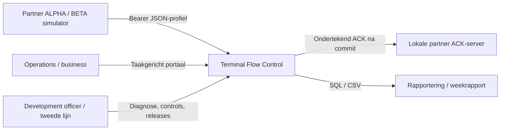
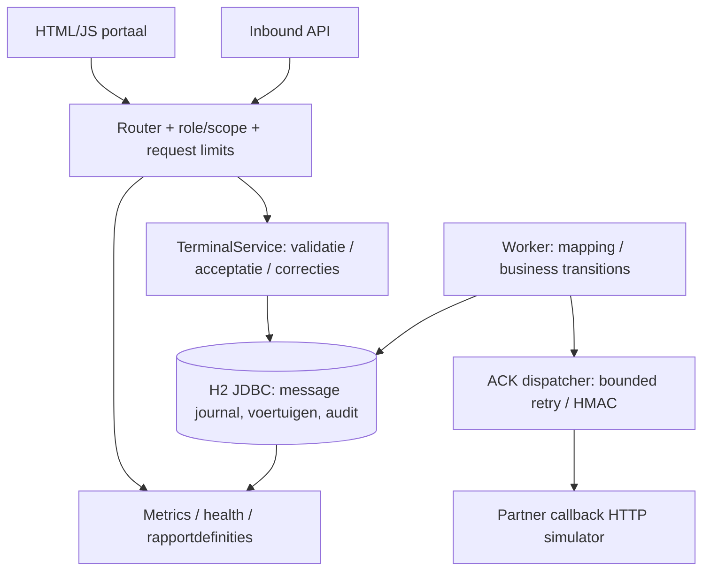
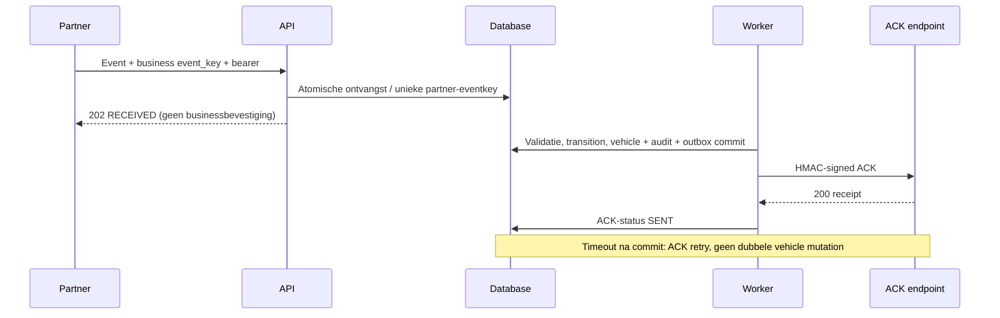
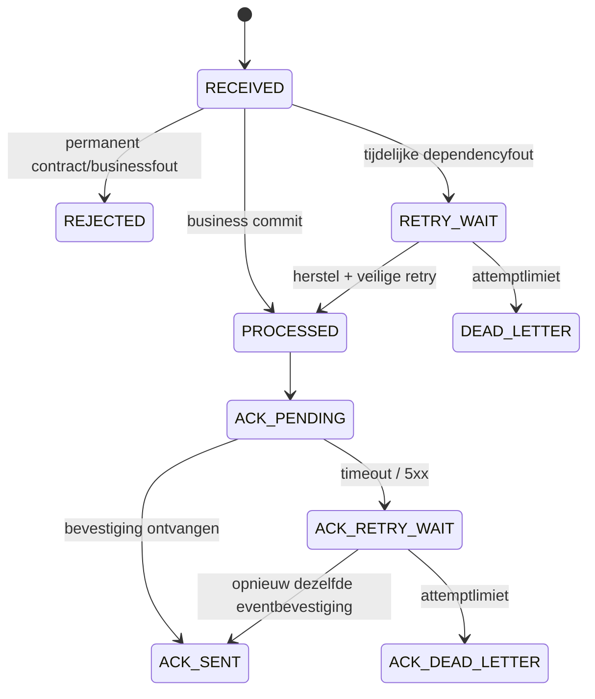
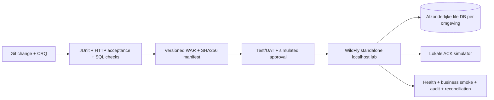

# Proposed system architecture — Terminal Flow Control

**Assumption / realistic simulation.** Vacature noemt TOS, AIX/IBM P-series, Oracle, JBoss, EDI, iWay, WebFOCUS, portalen en Apex; onderstaande topology is fictief. Dit is geen reconstructie van een vertrouwelijke ICO-omgeving.

## Centrale case

Partners sturen voertuig-aankomst, verplaatsing en vertrek voor twee sites. Operations ziet actuele locatie/status, kan gecontroleerd corrigeren en een hold laten beheren. Het systeem journaliseert ontvangst, verwerkt met businessregels en verstuurt na commit een afzonderlijke bevestiging. Reporting telt unieke actieve voertuigen met vaste site/partnerdefinitie. De medewerker onderzoekt backlog, afwijzingen, dubbele verzendingen, statusconflicten en release-effecten.

## System context

## Component diagram

## Data flow

## Integration flow

## Deployment architecture

Local fast path gebruikt JDK HttpServer met dezelfde router/domaincode. WAR heeft een echte Jakarta Servlet-adapter. De Servlet-container beheert init/destroy en start/stopt de worker. De local adapter is geen JBoss-vervanger; de WAR-test moet apart aantonen dat containerdeployment werkt.

## Grenzen en eigenaarschap

Eén monolith, één database, één actieve workerinstance: geen Kafka, Kubernetes, gedistribueerde locking of microservices. Local HTTP alleen op loopback; productionlike TLS, identityprovider, enterprise JDBC-pool en AIX moeten afzonderlijk ontworpen/gevalideerd worden. Authenticator gebruikt lokaal gegenereerde tokens en rol/site/partner-scope. Transportreceipt, businesscommit en ACK worden apart gelogd. Externe communicatie is fictief en wordt niet werkelijk naar ICO of leveranciers verzonden.

DB-atomiciteit bewaakt voertuig/audit/outbox. Callback kan duplicaat-ACK ontvangen: event-ID is stabiel en callback is idempotent. Slechts transient fouten worden automatisch opnieuw geprobeerd; malformed en ongeldige transitions blijven verklaarbaar afgewezen. Re-drive is bevoegd, gelogd en beperkt tot failed messages zonder reeds verwerkt event.
